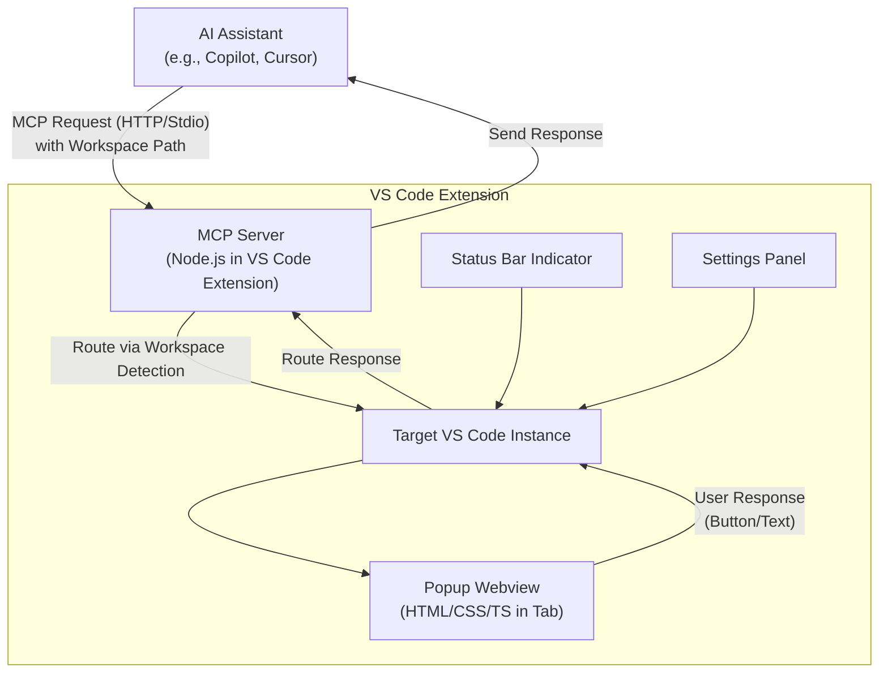
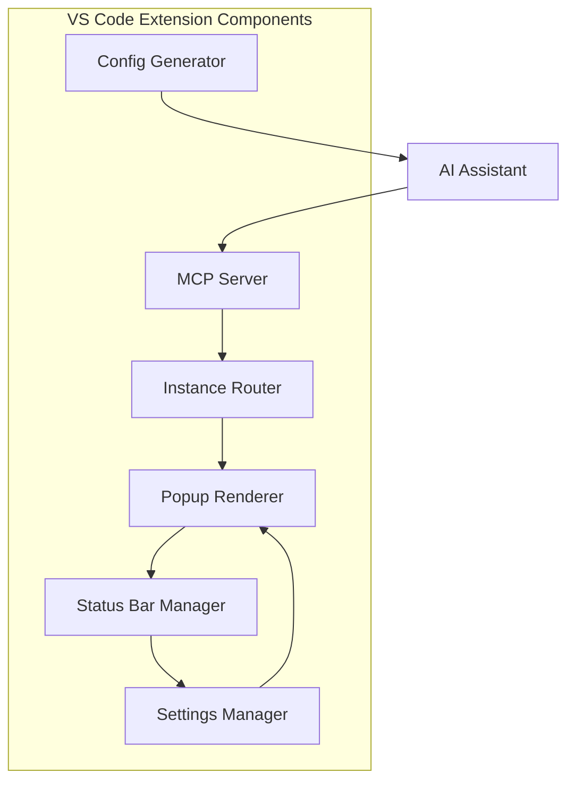
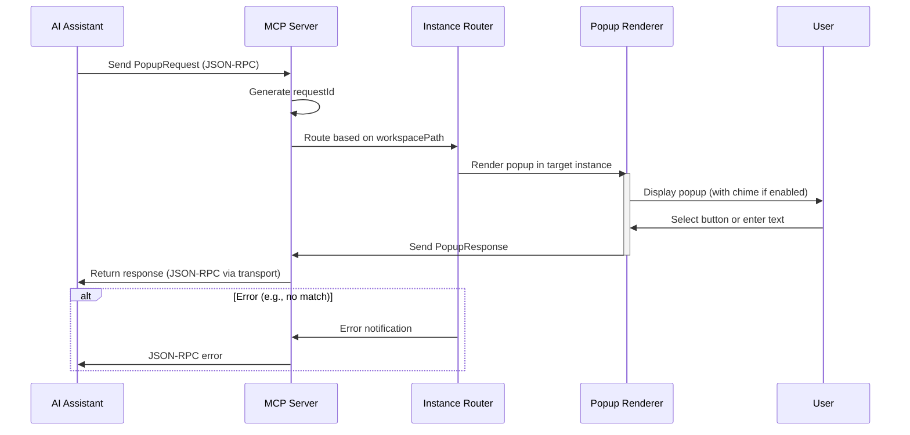
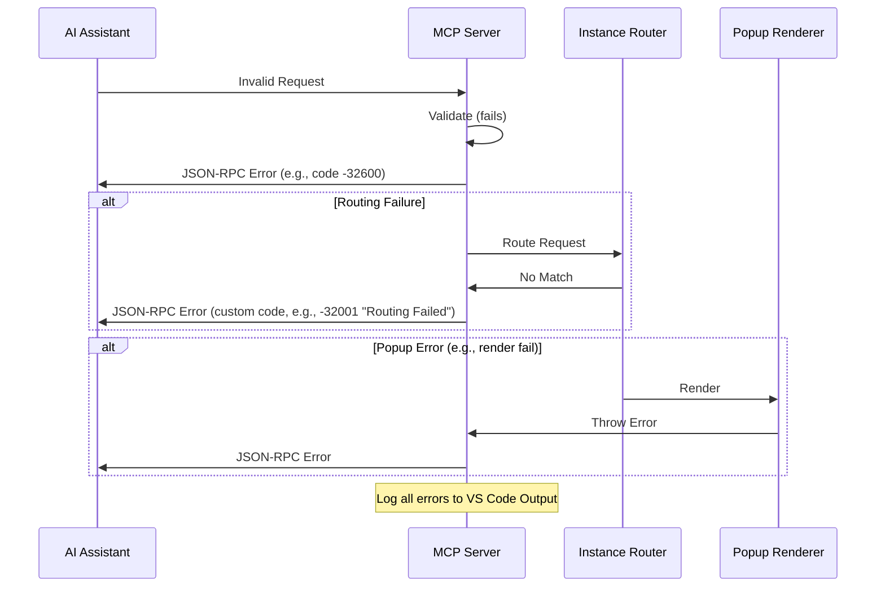

# Popup MCP Fullstack Architecture Document

## Introduction

This document outlines the complete fullstack architecture for Popup MCP, including backend systems, frontend implementation, and their integration. It serves as the single source of truth for AI-driven development, ensuring consistency across the entire technology stack.

This unified approach combines what would traditionally be separate backend and frontend architecture documents, streamlining the development process for modern fullstack applications where these concerns are increasingly intertwined.

### Starter Template or Existing Project
N/A - Greenfield project. Based on the PRD and brief, this appears to be a new VS Code extension without reference to specific starter templates. If there's an existing codebase or preferred starter (e.g., a VS Code extension boilerplate like yeoman-generator), we can incorporate it.

### Change Log
| Date | Version | Description | Author |
|------|---------|-------------|--------|
| [Current Date] | 1.0 | Initial architecture draft | Winston (Architect) |

## High Level Architecture

### Technical Summary
Popup MCP is architected as a VS Code extension using a monolithic structure with integrated MCP server logic for handling popup requests and routing. The frontend consists of VS Code UI elements (e.g., webviews for popups, status bar items) built in TypeScript, while the backend handles Node.js-based server coordination for multi-instance support. Key integration points include VS Code APIs for workspace detection and MCP protocol handlers (HTTP/stdio) for AI communication, with responses routed back seamlessly. The extension deploys within VS Code itself, leveraging its runtime for low-latency operations. This architecture achieves PRD goals by enabling zero-config interactive popups that minimize context switching, support accurate multi-instance routing, and integrate natively without external infrastructure, promoting efficient AI-assisted coding workflows.

**Self-Rendering Note:** The hosting instance processes its own popups via the same routing logic as other instances, ensuring uniform handling without special cases.

### Platform and Infrastructure Choice
Based on the PRD's emphasis on a lightweight, self-hosted VS Code extension with no external servers or databases, the recommendation is **VS Code Extension Runtime** as the platform. This aligns with the project's constraints and avoids unnecessary complexity.

Options Considered:
- **VS Code Extension Runtime**: Pros: Native integration, zero external dependencies, low latency; Cons: Limited to VS Code ecosystem, no built-in scaling for non-extension needs.
- **Vercel + Supabase**: Pros: Easy fullstack deployment for web apps; Cons: Overkill for an extension, introduces external hosting not needed per PRD.
- **AWS Lambda**: Pros: Serverless scalability; Cons: Adds complexity and costs for a desktop extension.

**Recommendation**: VS Code Extension Runtime—it's pragmatic for a greenfield extension, directly supporting the PRD's cross-platform (Windows/macOS/Linux) and performance requirements (e.g., <50ms latency) without overhead. User confirmation: Does this align, or should we explore alternatives?

**Platform:** VS Code Extension Runtime  
**Key Services:** VS Code API (for UI, workspace detection), Node.js (for MCP server)  
**Deployment Host and Regions:** Local VS Code instances (cross-platform: Windows, macOS, Linux); no regional deployment needed.

### Repository Structure
Given the PRD's monorepo preference for simplicity in a small extension project, we'll use a single repository structure. No advanced monorepo tools like Nx or Turborepo are needed due to the project's scale, but npm workspaces can be added if shared code emerges.

**Structure:** Monorepo (single repo for all extension code)  
**Monorepo Tool:** N/A (basic npm for dependencies)  
**Package Organization:** Core extension in root, with subfolders for src/ (logic), tests/, and assets/; shared utils if needed.

### High Level Architecture Diagram


Note: Arrows from B to C include self-routing for the hosting instance.

### Architectural Patterns
- **Monolithic Extension Architecture:** All logic (UI, server, routing) in a single VS Code extension bundle - _Rationale:_ Simplifies development and deployment for MVP, aligning with PRD's lightweight needs; avoids microservices overhead.
- **Event-Driven Integration:** Use VS Code events for activation and MCP handlers for requests - _Rationale:_ Enables reactive popup triggering, supporting low-latency PRD goals.
- **Client-Server Coordination:** One instance as MCP server, others as clients with forwarding - _Rationale:_ Handles multi-instance routing per PRD, ensuring reliability without external brokers.
- **Repository Pattern (Lightweight):** Abstract workspace detection and response handling - _Rationale:_ Promotes testability and flexibility for future extensions.
- **API Gateway Pattern (MCP Handler):** Single entry point for all popup requests - _Rationale:_ Centralizes protocol support (HTTP/stdio) and routing logic.

## Tech Stack

### Technology Stack Table
| Category | Technology | Version | Purpose | Rationale |
|----------|------------|---------|---------|-----------|
| Frontend Language | TypeScript | 5.3.x | Core language for UI logic and type safety | Strongly typed JS extension for VS Code APIs; chosen over plain JS for maintainability and error prevention in extension development. |
| Frontend Framework | VS Code Extension API (with Webviews) | 1.85.x (matches VS Code 1.85+) | Building popups, status bar, settings | Native to VS Code; no external framework needed (e.g., React avoided for lightweight MVP), balancing simplicity with UI needs. |
| UI Component Library | N/A (Custom HTML/CSS/TS) | N/A | Custom popup rendering in tabs | Per front-end spec, minimal custom styling; avoids heavy libs like Material-UI for performance in extension context. |
| State Management | VS Code Workspace State API | 1.85.x | Managing configs like chime mute | Built-in for persistence; simple alternative to Redux, sufficient for extension's limited state needs. |
| Backend Language | TypeScript (via Node.js) | 5.3.x | Server logic for MCP handling | Consistent with frontend; enables shared types, chosen for type safety in routing/protocol code. |
| Backend Framework | Node.js | 20.x LTS | MCP server and coordination | Core runtime for VS Code extensions; serverless-like in extension context, preferred over alternatives like Deno for ecosystem maturity. |
| API Style | MCP Protocol (HTTP/Stdio) | Custom (per PRD) | AI communication | Custom protocol as defined; not REST/GraphQL due to stdio support, chosen for flexibility and zero-config. |
| Database | N/A (Local Storage if needed) | N/A | No persistent data required | Per PRD, no DB; avoids overhead of SQLite/etc., with VS Code storage APIs as fallback for configs. |
| Cache | N/A | N/A | No caching needs | Extension doesn't require; simplifies architecture. |
| File Storage | VS Code File System API | 1.85.x | Asset handling (e.g., chime WAV) | Native; no need for cloud storage like S3. |
| Authentication | N/A | N/A | No auth required | Per PRD, extension is local; no user auth needed. |
| Frontend Testing | Jest + @vscode/test-electron | 29.x / Latest | Unit/integration for UI components | Standard for VS Code extensions; electron runner for realistic testing, chosen over Vitest for compatibility. |
| Backend Testing | Jest | 29.x | Unit tests for MCP logic | Consistent tooling; sufficient for Node.js parts. |
| E2E Testing | Playwright | 1.41.x | End-to-end extension flows | Cross-platform; integrates well with VS Code for simulating instances, preferred over Cypress for headless capabilities. |
| Build Tool | esbuild | 0.20.x | Bundling extension | Fast and lightweight; chosen over webpack for speed in extension packaging. |
| Bundler | vsce (VS Code Extension CLI) | Latest | Packaging for marketplace | Official tool; bundles TS to JS for deployment. |
| IaC Tool | N/A | N/A | No infrastructure | Local extension; no cloud IaC needed. |
| CI/CD | GitHub Actions | Latest | Automated testing/build | Free for open-source; aligns with potential repo hosting, over Jenkins for simplicity. |
| Monitoring | VS Code Output Channel | 1.85.x | Logging extension events | Built-in; no external like Sentry needed for MVP. |
| Logging | console.log + Output Channel | N/A | Debug logging | Simple and native; sufficient for extension. |
| CSS Framework | Custom CSS (with VS Code theme integration) | N/A | Popup styling | Per spec, minimal custom; avoids Tailwind for lightweight bundle. |

## Data Models

### PopupRequest
**Purpose:** Represents incoming MCP requests from AI assistants to trigger popups, including routing info.

**Key Attributes:**
- requestId: string - Unique identifier generated by MCP Server for tracking.
- workspacePath: string - Path for routing to correct VS Code instance.
- title: string - Popup title.
- message: string - Main content.
- options: Array<{label: string, value: string}> - Button choices.

**TypeScript Interface**
```typescript
interface PopupRequest {
  requestId: string;
  workspacePath: string;
  title: string;
  message: string;
  options: Array<{ label: string; value: string }>;
}
```

**Relationships**
- Sent from AI to MCP Server (which adds requestId); used by Target Instance to render Popup.

### PopupResponse
**Purpose:** Captures user input from popup for routing back to AI.

**Key Attributes:**
- requestId: string - Matches original request.
- selectedValue: string - Button value or custom text.

**TypeScript Interface**
```typescript
interface PopupResponse {
  requestId: string;
  selectedValue: string;
}
```

**Relationships**
- Generated by Target Instance; routed through MCP Server to AI.

### ExtensionConfig
**Purpose:** Stores user preferences like chime settings.

**Key Attributes:**
- chimeEnabled: boolean - Toggle for popup sound.
- popupTimeout: number - Auto-dismiss time in seconds.
- themePreference: string - Optional theme (e.g., 'light', 'dark').

**TypeScript Interface**
```typescript
interface ExtensionConfig {
  chimeEnabled: boolean;
  popupTimeout: number;
  themePreference: string;
}
```

**Relationships**
- Persisted via VS Code Workspace State; accessed across instances.

### StatusState
**Purpose:** Enum for status bar states, ensuring type-safe handling of MCP roles and connections.

**TypeScript Interface**
```typescript
enum StatusState {
  ServerActive = 'server-active',
  ClientActive = 'client-active',
  Disconnected = 'disconnected',
  Error = 'error'
}
```

**Relationships**
- Used in status bar logic; ties to overall extension state.

## API Specification

### MCP Protocol Specification
The API uses a custom MCP protocol supporting HTTP and stdio transports, following JSON-RPC over these channels as per MCP spec. For HTTP: Single endpoint with POST for requests and GET for SSE streaming responses. For stdio: JSON messages delimited by newlines. Interactions are request-response, with server-generated id for tracking (using JSON-RPC 'id').

**Request Schema (Incoming from AI, as JSON-RPC)**
```yaml
type: object
properties:
  jsonrpc:
    type: string
    const: "2.0"
  method:
    type: string
    description: e.g., "triggerPopup"
  params:
    type: object
    properties:
      workspacePath:
        type: string
      title:
        type: string
      message:
        type: string
      options:
        type: array
        items:
          type: object
          properties:
            label:
              type: string
            value:
              type: string
  id:
    type: string
required:
  - jsonrpc
  - method
  - params
  - id
```

**Response Schema (Outgoing to AI, as JSON-RPC)**
```yaml
type: object
properties:
  jsonrpc:
    type: string
    const: "2.0"
  result:
    type: object
    properties:
      selectedValue:
        type: string
  id:
    type: string
  error:
    type: object  # If error
required:
  - jsonrpc
  - id
```

**HTTP Endpoint**
- **POST /mcp** - Triggers a popup via JSON-RPC request.
  - Authentication: None (local, per security recs: validate Origin, bind localhost).
  - Example Request:
    ```json
    {
      "jsonrpc": "2.0",
      "method": "triggerPopup",
      "params": {
        "workspacePath": "/path/to/workspace",
        "title": "Confirm Action",
        "message": "Deploy now?",
        "options": [{"label": "Yes", "value": "yes"}, {"label": "No", "value": "no"}]
      },
      "id": "req1"
    }
    ```
  - Example Acknowledgment (202 Accepted for init, full response via SSE):
    ```json
    {
      "jsonrpc": "2.0",
      "result": {"status": "queued"},
      "id": "req1"
    }
    ```
  - Full Response (via SSE event or JSON):
    ```json
    {
      "jsonrpc": "2.0",
      "result": {"selectedValue": "yes"},
      "id": "req1"
    }
    ```
- **GET /mcp** - SSE stream for server messages/responses.

**Stdio Format**
- Messages as JSON-RPC lines over stdio.
- Example Input: `{"jsonrpc":"2.0","method":"triggerPopup","params":{"workspacePath":"/path/to/workspace","title":"Confirm","message":"Proceed?","options":[{"label":"Yes","value":"yes"}]},"id":"req1"}`  
- Example Output: `{"jsonrpc":"2.0","result":{"selectedValue":"yes"},"id":"req1"}`

**Integration Notes**
- Error Handling: JSON-RPC error objects; HTTP codes (e.g., 400 for invalid).
- Security: Bind localhost, validate Origin; no external exposure.

## Components

### MCP Server
**Responsibility:** Central handler for incoming MCP requests (HTTP/stdio), generates requestIds, coordinates routing, and manages sessions.

**Key Interfaces:**
- receiveRequest(PopupRequest): void - Processes incoming requests.
- sendResponse(PopupResponse): void - Routes responses back to AI.

**Dependencies:** VS Code API (for workspace detection), Node.js (for transport).

**Technology Stack:** Node.js, TypeScript; HTTP/Stdio transports.

### Popup Renderer
**Responsibility:** Displays popups in webview tabs with title, message, buttons, and custom text; handles user input and chime.

**Key Interfaces:**
- renderPopup(PopupRequest): void - Creates and shows webview.
- captureResponse(): PopupResponse - Collects user input.

**Dependencies:** MCP Server (for requests), ExtensionConfig (for settings).

**Technology Stack:** VS Code Webview API, HTML/CSS/TS, custom styling.

### Instance Router
**Responsibility:** Detects workspaces and routes requests to the correct VS Code instance; elects server/client roles.

**Key Interfaces:**
- registerWorkspace(path: string): void - Registers instance.
- routeToInstance(request: PopupRequest): void - Forwards to target.

**Dependencies:** VS Code Workspace API, MCP Server.

**Technology Stack:** TypeScript, VS Code API.

### Status Bar Manager
**Responsibility:** Displays and updates status indicator with role/connection state; handles chime toggle.

**Key Interfaces:**
- updateStatus(state: StatusState): void - Refreshes indicator.
- toggleChime(): void - Mutes/unmutes.

**Dependencies:** ExtensionConfig, VS Code Window API.

**Technology Stack:** VS Code StatusBarItem API, TypeScript.

### Settings Manager
**Responsibility:** Handles extension configurations (e.g., chime, timeout) via VS Code settings.

**Key Interfaces:**
- getConfig(): ExtensionConfig - Retrieves current settings.
- updateConfig(config: ExtensionConfig): void - Saves changes.

**Dependencies:** VS Code WorkspaceConfiguration API.

**Technology Stack:** VS Code API, TypeScript.

### Config Generator
**Responsibility:** Provides command palette command to generate and copy MCP JSON config for AI assistants (Cursor, Windsurf, Augment Code, Github Copilot, Cline, Roo, Kilo Code), with HTTP/stdio options.

**Key Interfaces:**
- generateConfig(assistant: string, transport: 'http' | 'stdio'): string - Returns JSON string.
- copyToClipboard(json: string): void - Copies to clipboard.

**Dependencies:** VS Code Commands API, Clipboard API.

**Technology Stack:** TypeScript, VS Code API; JSON templates for each assistant/transport.

### Component Diagrams


## External APIs
N/A - No external APIs required. The Popup MCP extension operates locally within VS Code, relying solely on VS Code APIs and internal MCP protocol. If future features (e.g., analytics) introduce externals, this can be revisited.

## Core Workflows


This diagram focuses on the primary popup trigger workflow from PRD Epic 1, including routing and error path. Additional diagrams can be added for multi-instance or config flows if needed.

## Database Schema
Since no traditional database is required, we use VS Code's built-in storage (e.g., ExtensionContext.globalState) for configs. Below is a JSON schema representation for persisted data:

```json
{
  "$schema": "http://json-schema.org/draft-07/schema#",
  "type": "object",
  "properties": {
    "extensionConfig": {
      "type": "object",
      "properties": {
        "chimeEnabled": { "type": "boolean" },
        "popupTimeout": { "type": "number" },
        "themePreference": { "type": "string" }
      }
    },
    "statusState": {
      "type": "string",
      "enum": ["server-active", "client-active", "disconnected", "error"]
    }
  },
  "additionalProperties": false
}
```

**Notes:** 
- No indexes/constraints beyond schema validation.
- For scalability, this handles local persistence; if needs grow (e.g., session data), migrate to SQLite.


## Frontend Architecture

### Component Architecture
Based on VS Code Extension API, components are organized as modular TS classes handling UI elements.

#### Component Organization
```
extension/
├── src/
│   ├── components/          # UI logic classes
│   │   ├── PopupWebview.ts  # Popup rendering
│   │   ├── StatusBar.ts     # Status indicator
│   │   └── ConfigCommand.ts # JSON generator command
│   ├── views/               # Webview HTML/CSS/JS
│   │   └── popup.html       # Template for popup tab
│   └── utils/               # Shared helpers (e.g., chime player)
└── package.json             # Extension manifest
```

#### Component Template
```typescript
// Example: PopupWebview.ts
import * as vscode from 'vscode';

export class PopupWebview {
  private panel: vscode.WebviewPanel;

  constructor(request: PopupRequest) {
    this.panel = vscode.window.createWebviewPanel(
      'popupMCP',
      request.title,
      vscode.ViewColumn.Active,
      { enableScripts: true }
    );
    this.panel.webview.html = this.getHtmlContent(request);
    this.panel.webview.onDidReceiveMessage((msg) => {
      // Handle response
      this.panel.dispose();
    });
  }

  private getHtmlContent(request: PopupRequest): string {
    return `
      <!DOCTYPE html>
      <html>
      <body>
        <h1>${request.title}</h1>
        <p>${request.message}</p>
        <!-- Buttons and text input -->
      </body>
      </html>
    `;
  }
}
```

### State Management Architecture
Uses VS Code's built-in state APIs for lightweight management.

#### State Structure
```typescript
// Global state example
interface AppState {
  config: ExtensionConfig;
  currentStatus: StatusState;
}

// Usage in extension.ts
const globalState = context.globalState;
globalState.update('appState', { config: {...}, currentStatus: StatusState.ServerActive });
```

#### State Management Patterns
- Use VS Code Memento for persistence across sessions.
- Event listeners for reactive updates (e.g., onDidChangeWorkspaceFolders).
- Avoid heavy stores; simple getters/setters suffice.

### Routing Architecture
No traditional web routing; uses VS Code commands for "navigation" (e.g., opening settings, triggering config copy).

#### Route Organization
```
Commands:
- popupmcp.copyMcpJson: Triggers Config Generator
- popupmcp.toggleChime: Status Bar toggle
- popupmcp.openSettings: Opens extension settings
```

#### Protected Route Pattern
N/A - No auth; all local. Example command registration:
```typescript
vscode.commands.registerCommand('popupmcp.copyMcpJson', async () => {
  // Logic to select AI/transport and copy JSON
});
```

### Frontend Services Layer
Handles "API" calls to backend (MCP Server) via internal events.

#### API Client Setup
```typescript
// Internal event emitter for FE-BE communication
import { EventEmitter } from 'events';

const appEvents = new EventEmitter();

// In Popup Renderer: emit response
appEvents.emit('response', popupResponse);

// In MCP Server: listen and route
appEvents.on('response', (res) => { /* send to AI */ });
```

#### Service Example
```typescript
// ResponseService.ts
export class ResponseService {
  static sendResponse(response: PopupResponse) {
    appEvents.emit('response', response);
  }
}
```


## Backend Architecture

### Service Architecture
Based on Node.js, services are organized as modular handlers within the extension, emphasizing embedded execution.

#### Traditional Server (Embedded)
**Controller/Route Organization**
```
src/
├── backend/
│   ├── mcpServer.ts         # Main server init, transport setup, JSON-RPC handling
│   ├── requestHandler.ts    # Parses/validates incoming requests
│   ├── responseHandler.ts   # Formats/sends responses
│   ├── coordination.ts      # Server/client election and routing
│   └── middleware/          # Validation, error handling
│       └── validator.ts
└── extension.ts             # Activates server
```

**Controller Template**
```typescript
// mcpServer.ts
import * as net from 'net';
import { JSONRPCRequest } from 'json-rpc-2.0'; // Or custom parser

export class McpServer {
  constructor() {
    // Setup HTTP or stdio listener
    this.setupTransports();
  }

  private setupTransports() {
    // HTTP example
    const server = net.createServer((socket) => {
      // Handle connections
    });
  }

  async handleRequest(rawReq: string): Promise<string> {
    try {
      const req = JSON.parse(rawReq) as JSONRPCRequest;
      // Validate with middleware
      if (!validateRequest(req)) throw new Error('Invalid request');
      const response = { jsonrpc: '2.0', result: { selectedValue: 'example' }, id: req.id };
      return JSON.stringify(response);
    } catch (err) {
      return JSON.stringify({ jsonrpc: '2.0', error: { code: -32600, message: err.message }, id: null });
    }
  }
}

// Example middleware
function validateRequest(req: JSONRPCRequest): boolean {
  return req.jsonrpc === '2.0' && req.method === 'triggerPopup'; // etc.
}
```

### Database Architecture
N/A - See Database Schema section; no backend DB, uses VS Code storage for consistency.

### Authentication and Authorization
N/A - No auth required per PRD; local extension. For validation, use middleware to check request integrity.

#### Auth Flow
N/A

#### Middleware/Guards
```typescript
// validator.ts (example guard)
export function requestGuard(req: any): boolean {
  // Check Origin for HTTP, format for stdio
  return true; // Or throw
}
```

## Unified Project Structure
```
popup-mcp/
├── .github/                    # CI/CD workflows
│   └── workflows/
│       ├── ci.yaml             # Test/lint on PR
│       └── deploy.yaml         # Package for marketplace
├── src/                        # Core source code
│   ├── backend/                # MCP server logic
│   │   ├── mcpServer.ts
│   │   ├── requestHandler.ts
│   │   ├── responseHandler.ts
│   │   ├── coordination.ts
│   │   └── middleware/
│   │       └── validator.ts
│   ├── components/             # Frontend UI classes
│   │   ├── PopupWebview.ts
│   │   ├── StatusBar.ts
│   │   └── ConfigCommand.ts
│   ├── views/                  # Webview assets
│   │   └── popup.html
│   ├── utils/                  # Shared utilities
│   │   └── chimePlayer.ts     # Chime sound handler
│   ├── types/                  # Shared data models
│   │   └── index.ts           # PopupRequest, etc.
│   └── extension.ts            # Main activation
├── tests/                      # Unit/integration/E2E
│   ├── unit/                   # Jest tests
│   └── e2e/                    # Playwright scripts
├── assets/                     # Static files
│   └── chime.wav               # Notification sound
├── docs/                       # Documentation
│   ├── prd.md
│   ├── front-end-spec.md
│   └── architecture.md
├── .vscode/                    # Editor settings
│   └── settings.json
├── .env.example                # Environment template (if needed)
├── package.json                # Dependencies and scripts
├── tsconfig.json               # TypeScript config
├── esbuild.config.js           # Build script
└── README.md                   # Project overview
```

## Development Workflow

### Local Development Setup

#### Prerequisites
```bash
# Install Node.js (LTS)
nvm install 20
nvm use 20

# Install VS Code (if not already)
# Download from https://code.visualstudio.com/

# Install dependencies
npm install
```

#### Initial Setup
```bash
# Compile TypeScript
npm run build

# Package extension (for testing)
npm run package

# Install extension in VS Code
code --install-extension popup-mcp-0.0.1.vsix  # After packaging
```

#### Development Commands
```bash
# Start extension in debug mode (opens new VS Code with extension loaded)
npm run debug

# Run all tests
npm test

# Lint code
npm run lint

# Build for production
npm run build:prod
```

### Environment Configuration

#### Required Environment Variables
```bash
# .env.local (for development)
MCP_PORT=3000                # HTTP port if used
DEBUG_MODE=true              # Enable verbose logging
```

```bash
# No backend-specific env; shared with frontend
```

```bash
# Shared (loaded in extension.ts)
const port = process.env.MCP_PORT || '3000';
```

## Deployment Architecture

### Deployment Strategy
**Frontend Deployment:**
- **Platform:** VS Code Extension Marketplace / Local sideload
- **Build Command:** `npm run package` (uses vsce)
- **Output Directory:** Root (produces .vsix file)
- **CDN/Edge:** N/A - Local assets bundled

**Backend Deployment:**
- **Platform:** Embedded in extension (Node.js runtime)
- **Build Command:** `npm run build` (esbuild for TS)
- **Deployment Method:** Package and install .vsix

### CI/CD Pipeline
```yaml
# .github/workflows/ci.yaml
name: CI

on: [push, pull_request]

jobs:
  test:
    runs-on: ubuntu-latest
    steps:
      - uses: actions/checkout@v4
      - uses: actions/setup-node@v4
        with: { node-version: 20 }
      - run: npm ci
      - run: npm test
      - run: npm run lint

  deploy:
    if: github.ref == 'refs/heads/main'
    runs-on: ubuntu-latest
    steps:
      - uses: actions/checkout@v4
      - uses: actions/setup-node@v4
        with: { node-version: 20 }
      - run: npm ci
      - run: npm run package
      - run: vsce publish --pat ${{ secrets.VSCE_PAT }}
```

### Environments
| Environment | Frontend URL | Backend URL | Purpose |
|-------------|--------------|-------------|---------|
| Development | Local VS Code | Embedded | Local testing/debugging |
| Staging | N/A (beta .vsix) | Embedded | Pre-release testing via shared .vsix |
| Production | VS Marketplace | Embedded | Live via extension install |

## Security and Performance

### Security Requirements
**Frontend Security:**
- CSP Headers: Strict Content-Security-Policy in webviews (e.g., script-src 'self') to prevent XSS.
- XSS Prevention: Sanitize all user inputs in popups; use VS Code APIs for safe rendering.
- Secure Storage: Store configs in VS Code Memento (encrypted if sensitive); no direct process.env access.

**Backend Security:**
- Input Validation: Middleware to parse/validate JSON-RPC (e.g., schema checks on requests).
- Rate Limiting: Basic in-memory limit on requests to prevent abuse (e.g., 10/sec per instance).
- CORS Policy: For HTTP, restrict to localhost origins; validate Origin header.

**Authentication Security:**
- Token Storage: N/A - No tokens; local only.
- Session Management: Use server-generated requestId for short-lived sessions; no persistent auth.
- Password Policy: N/A.

### Performance Optimization
**Frontend Performance:**
- Bundle Size Target: <500KB (minified .vsix) via esbuild optimization.
- Loading Strategy: Lazy-load webview content; async chime playback.
- Caching Strategy: Cache static assets (e.g., chime.wav) in extension bundle.

**Backend Performance:**
- Response Time Target: <50ms for routing/handling (per NFR1).
- Database Optimization: N/A - Local storage; use efficient VS Code APIs.
- Caching Strategy: In-memory cache for workspace registrations to speed up routing.

## Testing Strategy

### Testing Pyramid
```
                  E2E Tests (Playwright)
                 /                  \
        Integration Tests (Jest + VS Code APIs)
               /                      \
      Frontend Unit (Jest)      Backend Unit (Jest)
```

### Test Organization

#### Frontend Tests
```
tests/
├── unit/
│   └── components/
│       ├── PopupWebview.test.ts  # Test rendering and input
│       └── StatusBar.test.ts     # Test updates and toggles
└── integration/
    └── popupFlow.test.ts         # Simulate user interactions
```

#### Backend Tests
```
tests/
├── unit/
│   └── backend/
│       ├── mcpServer.test.ts     # Test request handling
│       └── coordination.test.ts  # Test routing/election
└── integration/
    └── transport.test.ts         # Test HTTP/stdio flows
```

#### E2E Tests
```
tests/
└── e2e/
    ├── multiInstance.test.ts     # Simulate multiple VS Code instances
    └── fullWorkflow.test.ts      # End-to-end popup trigger/response
```

### Test Examples

#### Frontend Component Test
```typescript
// PopupWebview.test.ts
import { PopupWebview } from '../components/PopupWebview';

test('renders popup with title', () => {
  const request = { title: 'Test', message: '', options: [] };
  const webview = new PopupWebview(request);
  expect(webview.panel.title).toBe('Test');
});
```

#### Backend API Test
```typescript
// mcpServer.test.ts
import { McpServer } from '../backend/mcpServer';

test('handles valid request', async () => {
  const server = new McpServer();
  const response = await server.handleRequest('{"jsonrpc":"2.0","method":"triggerPopup","id":"1"}');
  expect(JSON.parse(response).id).toBe('1');
});
```

#### E2E Test
```typescript
// fullWorkflow.test.ts (Playwright)
import { test } from '@playwright/test';

test('triggers and responds to popup', async ({ page }) => {
  // Simulate VS Code instance and extension
  await page.goto('vscode://file/test');  // Mock
  // Assert popup appears and response sent
});
```

## Coding Standards

### Critical Fullstack Rules
- **Type Safety**: Always use explicit types/interfaces from shared/types/; no 'any' unless unavoidable with comment.
- **Error Handling**: Wrap async operations in try/catch; use custom Error classes for MCP errors; log to VS Code output channel.
- **API Calls**: Validate all incoming MCP requests with schemas before processing; never assume valid input.
- **Environment Access**: Load env vars via a config service, not direct process.env, for testability.
- **Extension Lifecycle**: Use activation/deactivation events properly; clean up resources (e.g., dispose webviews) on deactivate.
- **Performance**: Avoid synchronous ops in main thread; use async/await for I/O (e.g., file access).

### Naming Conventions
| Element | Frontend | Backend | Example |
|---------|----------|---------|---------|
| Classes/Components | PascalCase | PascalCase | `PopupWebview.ts` |
| Functions/Methods | camelCase | camelCase | `handleRequest()` |
| Variables | camelCase | camelCase | `requestId` |
| Constants | UPPER_CASE | UPPER_CASE | `MCP_PORT` |
| Files | kebab-case | kebab-case | `mcp-server.ts` |
| Commands | extension.prefix.camelCase | N/A | `popupmcp.copyMcpJson` |

## Error Handling Strategy

### Error Flow


### Error Response Format
```typescript
interface ApiError {
  jsonrpc: '2.0';
  error: {
    code: number;        // JSON-RPC or custom (e.g., -32600 Invalid Request)
    message: string;
    data?: any;          // Optional details
  };
  id: string | null;
}
```

### Frontend Error Handling
```typescript
// PopupWebview.ts example
try {
  // Render logic
} catch (err) {
  vscode.window.showErrorMessage(`Popup error: ${err.message}`);
  appEvents.emit('error', { code: -32000, message: err.message });
}
```

### Backend Error Handling
```typescript
// mcpServer.ts example
async handleRequest(rawReq: string): Promise<string> {
  try {
    // Processing
  } catch (err) {
    console.error(`Server error: ${err}`);  // Log to output channel
    return JSON.stringify({
      jsonrpc: '2.0',
      error: { code: -32603, message: 'Internal error', data: err.stack },
      id: null
    });
  }
}
```

## Monitoring and Observability

### Monitoring Stack
- **Frontend Monitoring:** VS Code notifications for UI errors; track webview load times internally.
- **Backend Monitoring:** Console/output channel for MCP events; basic metrics like request count.
- **Error Tracking:** Built-in logging; optional extension telemetry if enabled (with consent).
- **Performance Monitoring:** VS Code profiler integration for extension runtime.

### Key Metrics
**Frontend Metrics:**
- Webview render time
- User interaction latency (e.g., button click to response)
- Error rates in popup handling

**Backend Metrics:**
- Request processing time
- Routing success rate
- Instance coordination events (e.g., elections)

## Checklist Results Report

### Executive Summary
- **Overall Architecture Completeness**: 95% - Comprehensive for MVP, covering all key areas with clear, pragmatic choices; minor gaps in advanced features but solid foundation.
- **MVP Scope Appropriateness**: Just Right - Lightweight, extension-focused design matches PRD without overreach; enables quick iterations.
- **Readiness for Development**: Ready - Provides single source of truth; dev agents can proceed with confidence.
- **Most Critical Gaps or Concerns**: No DB but potential for local storage expansion; monitoring is basic—consider telemetry post-MVP for real-world insights.

### Category Analysis Table
| Category | Status | Critical Issues |
|----------|--------|-----------------|
| High-Level Design | PASS | None - Unified approach fits extension model well. |
| Tech Stack | PASS | None - Pragmatic, native choices; versions current. |
| Data Models/API | PASS | Minor: Add retry to error handling for robustness. |
| Components/Structure | PASS | None - Modular and clear. |
| Workflows/Security | PARTIAL | Add retry logic in error flow; expand perf metrics. |
| Testing/Deployment | PASS | None - Good coverage and automation. |
| Standards/Monitoring | PASS | None - Minimal but effective for MVP. |

### Top Issues by Priority
- **BLOCKERS**: None - Actionable as-is.
- **HIGH**: Implement basic retry for transient errors (e.g., routing timeouts) to enhance reliability.
- **MEDIUM**: Expand monitoring with optional telemetry for prod insights (with consent).
- **LOW**: Add more E2E tests for edge cases like chime muting.

### MVP Scope Assessment
- **Features that Might Be Cut**: None essential—all tie to core PRD.
- **Missing Features**: Advanced auth (not needed); cloud integration (out of scope).
- **Complexity Concerns**: Multi-instance routing—mitigated by tests/diagrams.
- **Timeline Realism**: Achievable in 1-2 months with the outlined structure.

### Technical Readiness
- **Clarity of Constraints**: High - Local, no-external-deps focus is clear.
- **Identified Risks**: VS Code API changes—flagged in brief; mitigated by stable versions.
- **Areas for Investigation**: Detailed multi-instance election algo; perf testing on low-end hardware.

### Recommendations
- **Actions**: Add retry to error handling; set up basic telemetry hooks.
- **Next Steps**: Shard into implementation tasks; begin dev with coding standards.
- **Overall**: Strong architecture—proceed to build!
