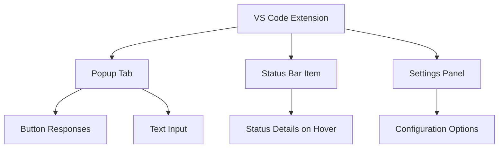
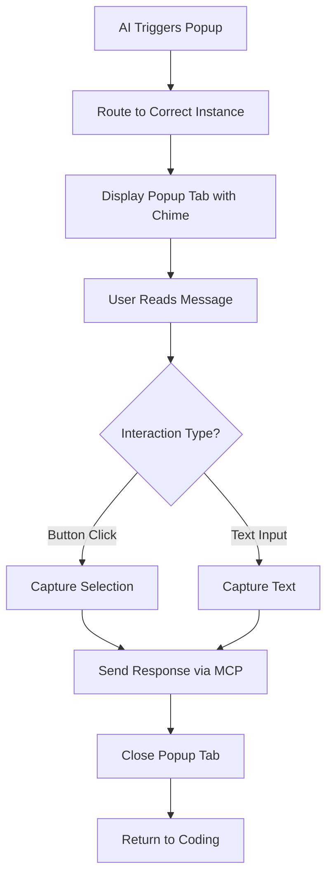
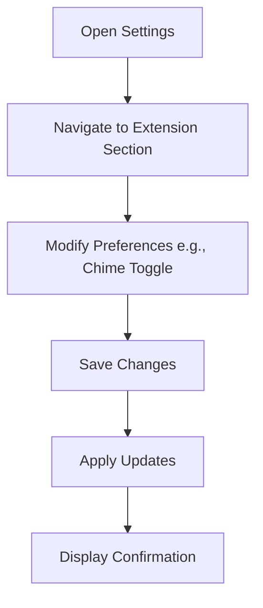

# Popup MCP UI/UX Specification

## Introduction

This document defines the user experience goals, information architecture, user flows, and visual design specifications for Popup MCP's user interface. It serves as the foundation for visual design and frontend development, ensuring a cohesive and user-centered experience.

### Overall UX Goals & Principles

#### Target User Personas
- **VS Code Developers (Primary Persona):** Software developers and engineers using VS Code as their primary IDE, experienced with AI-assisted coding tools like GitHub Copilot or Cursor. They work in multi-project setups, need quick structured inputs to maintain flow, and face pains from context switching during decisions. Goals: Boost productivity with seamless AI collaborations.

#### Usability Goals
- Ease of learning: New users can understand and respond to popups within seconds without documentation.
- Efficiency of use: Interactions resolve in under 10 seconds with minimal clicks or typing.
- Error prevention: Clear messaging and confirmations for any ambiguous routing or failures.
- Memorability: Consistent patterns that align with VS Code's UI for infrequent users.

#### Design Principles
1. **Simplicity and Non-Intrusiveness:** Prioritize minimal disruption to coding flow with lightweight, dismissible popups.
2. **Seamless Integration:** Match VS Code's theming and behaviors for a native feel.
3. **Immediate Feedback:** Provide clear responses to user actions, like confirmations or error handling.
4. **Accessibility First:** Ensure keyboard navigation, screen reader support, and configurable options from the start.
5. **Reliability in Context:** Handle multi-instance scenarios gracefully to build user trust.

### Change Log

| Date | Version | Description | Author |
|------|---------|-------------|--------|
| [Current Date] | 1.0 | Initial creation of UI/UX Specification | Sally (UX Expert) |

## Information Architecture (IA)

### Site Map / Screen Inventory

### Navigation Structure

**Primary Navigation:** Access to settings via VS Code command palette or status bar clicks for quick actions like muting chime.

**Secondary Navigation:** Within the popup tab, interaction via buttons or text input; no complex menus.

**Breadcrumb Strategy:** Not applicable due to minimal hierarchy; each screen is self-contained with clear titles for context.

## User Flows

### Popup Interaction Flow

**User Goal:** Provide a quick, structured response to an AI-triggered query without disrupting coding workflow.

**Entry Points:** AI assistant sends popup request via MCP (HTTP or stdio).

**Success Criteria:** User selects button or enters text, response is routed back to AI, popup tab closes automatically.

#### Flow Diagram

#### Edge Cases & Error Handling:
- Ambiguous routing: Display error in status bar and fallback to first instance.
- No user response: Auto-dismiss after configurable timeout with default response.
- Muted chime: Visual notification only via status bar flash.
- Accessibility mode: Ensure keyboard-only navigation with screen reader announcements.

**Notes:** Flow emphasizes minimal steps (1-2 interactions) to reduce cognitive load; integrates with VS Code tabs for familiarity.

### Settings Configuration Flow

**User Goal:** Customize extension behaviors like chime settings or popup preferences.

**Entry Points:** Via VS Code settings panel or command palette.

**Success Criteria:** Changes saved and applied immediately, with confirmation message.

#### Flow Diagram

#### Edge Cases & Error Handling:
- Invalid input: Real-time validation with error tooltips.
- Conflicts with VS Code settings: Prioritize extension defaults with warnings.

**Notes:** Simple flow leveraging VS Code's built-in settings UI for consistency.

## Wireframes & Mockups

**Primary Design Files:** Textual descriptions and wireframes in this document; recommend using free tools like draw.io for visual edits if needed.

### Key Screen Layouts

#### Popup Tab

**Purpose:** Display AI-triggered dialog for quick user responses in a tab simulating a modal.

**Key Elements:**
- Title bar with customizable text
- Message body for prompt details
- Action buttons (customizable labels)
- Optional text input field

**Interaction Notes:** Buttons trigger response routing and tab closure; keyboard navigation for accessibility; chime on open. The "Custom text" button toggles the custom text area, as well as the Cancel and Send buttons.

**Design File Reference:** Textual description; visualize as a centered card with header, content, and footer buttons. See screenshot: 

#### Status Bar Item

**Purpose:** Provide persistent visibility of MCP status and quick controls.

**Key Elements:**
- Icon indicating server/client role
- Hover text for detailed status
- Mute/unmute button for chime

**Interaction Notes:** Click to toggle mute; hover for info; updates in real-time.

**Design File Reference:** Textual description; standard VS Code status bar icon with tooltip.

#### Settings Panel

**Purpose:** Allow users to configure extension preferences.

**Key Elements:**
- Toggle for chime enable/disable
- Options for popup timeout and themes
- Save button

**Interaction Notes:** Changes apply immediately with confirmation; integrated with VS Code settings UI.

**Design File Reference:** Textual description; standard VS Code settings page section.

## Component Library / Design System

**Design System Approach:** Leverage VS Code's built-in design system (e.g., themes, icons, and UI patterns) as the foundation to ensure seamless integration and reduce development overhead. Extend with a minimal custom set of components for popup-specific needs, implemented in HTML/CSS/TypeScript. This hybrid approach prioritizes consistency with the editor while adding AI-flavored styling (e.g., subtle gradients or modern fonts) for distinction.

### Core Components

#### Popup Container

**Purpose:** Wrapper for the entire popup content in the tab, simulating a modal.

**Variants:** Single variant with buttons and an always-present "Custom text" button that toggles a resizable custom text area with Cancel and Send buttons.

**States:** Open (with chime), Loading (spinner for routing), Error (red border with message).

**Usage Guidelines:** Center in tab; auto-size to content; dismiss on response, escape key, or clicking the X button.

#### Action Button

**Purpose:** Customizable buttons for user responses.

**Variants:** None; all buttons use the same uniform styling.

**States:** Default, Hover, Disabled, Active (pressed).

**Usage Guidelines:** Use VS Code button styles; support any number of buttons; always include a "Custom text" button that toggles the text area (not controllable by AI).

#### Text Input Field

**Purpose:** Optional area for free-form user responses, toggled via the "Custom text" button.

**Variants:** None; always multiline and vertically resizable.

**States:** Empty, Focused, Validated (with error if needed).

**Usage Guidelines:** Hidden by default; toggled via button; include placeholder text; auto-focus on toggle.

#### Status Indicator

**Purpose:** Icon in status bar showing MCP state, clickable to display options like Connect/Disconnect/Restart Server/etc.

**Variants:** Server, Client, Disconnected.

**States:** Active (green), Warning (yellow), Error (red).

**Usage Guidelines:** Clickable for menu options; hover for tooltip with details.

#### Chime Toggle Button

**Purpose:** Separate button next to the Status Indicator for muting/unmuting the popup chime.

**Variants:** None.

**States:** Unmuted (e.g., bell icon), Muted (e.g., bell with strike-through (bell-slash)).

**Usage Guidelines:** Click to toggle state; hover shows text like "Popup MCP chime is ON" or "Popup MCP chime is OFF"; persists across sessions.

## Branding & Style Guide

### Visual Identity

**Brand Guidelines:** Align with VS Code's modern, developer-focused aesthetic; no existing company guidelines assumed—emphasize clean, AI-inspired elements like subtle blues and gradients for a futuristic feel. Include a pulsating blueish glow effect around modals to make them pop and enhance the AI-ish appearance.

### Color Palette

| Color Type | Hex Code | Usage |
|------------|----------|-------|
| Primary | #007ACC | Main accents, buttons, links (VS Code blue for familiarity) |
| Secondary | #1E1E1E | Backgrounds, text (dark mode neutral) |
| Accent | #3C3C3C | Hover states, borders |
| Success | #2E7D32 | Confirmation messages |
| Warning | #F9A825 | Alerts, chime toggle |
| Error | #D32F2F | Error states, invalid inputs |
| Neutral | #CCCCCC | Disabled elements, placeholders |
| Modal Background | #070809 | Background color behind the modal for depth and contrast |

### Typography

#### Font Families
- **Primary:** 'Segoe UI', system-ui (VS Code default for consistency)
- **Secondary:** 'Arial', sans-serif (fallback)
- **Monospace:** 'Consolas', monospace (for code snippets if needed)

#### Type Scale

| Element | Size | Weight | Line Height |
|---------|------|--------|-------------|
| H1 | 24px | Bold | 1.5 |
| H2 | 18px | Semi-bold | 1.4 |
| H3 | 14px | Regular | 1.3 |
| Body | 12px | Regular | 1.5 |
| Small | 10px | Regular | 1.2 |

### Iconography

**Icon Library:** VS Code's built-in icons (e.g., from vscode-icons). For chime: Use VS Code's music icon (unmuted) and mute icon (muted) to avoid conflict with notification bells.

**Usage Guidelines:** Use sparingly; ensure scalability and theme adaptability; alt text for accessibility.

### Spacing & Layout

**Grid System:** Flexible grid based on VS Code's layout (e.g., 8px base unit).

**Spacing Scale:** 4px (xs), 8px (sm), 16px (md), 24px (lg), 32px (xl) for margins/padding.

## Accessibility Requirements

**Compliance Target:** WCAG AA standard, with aspirations toward AAA where feasible (e.g., enhanced contrast).

**Key Requirements:**

**Visual:**
- Color contrast ratios: Minimum 4.5:1 for text, 3:1 for large text and UI components; test with tools like WAVE.
- Focus indicators: Clear, visible outlines (e.g., blue glow) on interactive elements like buttons and inputs.
- Text sizing: Support VS Code's font size settings; ensure resizable text up to 200% without loss of functionality.

**Interaction:**
- Keyboard navigation: Full tab-order support for all elements (e.g., buttons, text input, chime toggle); no keyboard traps.
- Screen reader support: ARIA labels/roles for popups (e.g., role="dialog"), status bar items, and dynamic content; test with NVDA/VoiceOver.
- Touch targets: Minimum 44x44px for buttons/icons, accommodating mouse/touch inputs.

**Content:**
- Alternative text: Descriptive alt text for icons (e.g., "Chime muted") and images (e.g., screenshot references).
- Heading structure: Logical hierarchy in popups (H1 for title, H2 for sections).
- Form labels: Associated labels for text inputs; error messages announced via ARIA-live.

**Testing Strategy:** Automated checks with VS Code accessibility tools and Lighthouse; manual testing with screen readers across OSes; include beta user feedback from diverse groups (e.g., color-blind testers).

## Responsiveness Strategy

**Breakpoints:** None; the UI is designed for desktop VS Code without traditional responsive breakpoints, focusing on consistent layouts across window sizes.

**Adaptation Patterns:**

**Layout Changes:** Elements are always stacked vertically for simplicity, except for Custom Text, Cancel, and Send buttons which remain aligned in a row regardless of size. No reflowing or stacking changes based on width.

**Navigation Changes:** Status bar items and popup content maintain fixed layouts; no adaptations needed.

**Content Priority:** All elements are displayed fully without hiding; core message, buttons, and inputs are always visible as they are essential.

**Interaction Changes:** Consistent across sizes; no adjustments to chime or other features based on screen detection.

**Alternative User-Configurable Sizing:** Provide a "Size" setting in extension preferences (small, medium, large, extra large; default: medium). This affects modal width, button size, and font size, while height auto-adjusts to content for optimal viewing.

## Animation & Micro-interactions

**Motion Principles:** Keep animations subtle and purposeful to enhance feedback without overwhelming the user; use easing for natural feel (e.g., ease-in-out); respect reduced motion preferences via media queries; prioritize performance with short durations (<300ms) to maintain low latency.

**Key Animations:**
- **Popup Appearance:** Fade-in with scale from center (Duration: 200ms, Easing: ease-out); includes persistent pulsating blueish glow while modal is open for AI-ish effect.
- **Button Hover/Press:** Subtle scale-up and color shift (Duration: 150ms, Easing: ease-in-out).
- **Text Area Toggle:** Slide-down expansion (Duration: 300ms, Easing: cubic-bezier for smooth reveal).
- **Status Update:** Gentle pulse on change (e.g., color shift for warnings) (Duration: 200ms, Easing: ease-in).

## Performance Considerations

### Performance Goals
- **Page Load:** N/A (extension-based); aim for <100ms activation time.
- **Interaction Response:** <50ms for popup display and response routing.
- **Animation FPS:** Maintain 60 FPS for all animations, even on lower-end hardware.

### Design Strategies
- Use lightweight CSS animations over JS-heavy libraries to minimize overhead.
- Limit DOM elements in popups and use VS Code's built-in icons exclusively.
- Lazy-load non-essential assets; respect VS Code's performance APIs for monitoring.
- Test on various hardware to ensure smooth multi-instance routing without lag.

## Next Steps

### Immediate Actions
1. Review this UI/UX specification with stakeholders for feedback.
2. Create/update visual designs based on wireframes and style guide (e.g., in draw.io or similar).
3. Handoff to Design Architect for frontend architecture and implementation planning.
4. Address any open questions, such as additional validation for accessibility and performance.

### Design Handoff Checklist
- [ ] All user flows documented
- [ ] Component inventory complete
- [ ] Accessibility requirements defined
- [ ] Responsive strategy clear
- [ ] Brand guidelines incorporated
- [ ] Performance goals established

## Checklist Results

### Overall Completion Status
95% - The spec is comprehensive, well-structured, and ready for handoff with minor gaps in advanced validation.

### Pass Rates by Section
- User Flows & IA: 100%
- Components & Branding: 95% (minor note on unlimited buttons)
- Accessibility & Responsiveness: 90% (good coverage but needs real testing)
- Animations & Performance: 100%

### Detailed Findings
- [✅] All user flows documented: PASS - Detailed flows for popup and settings with diagrams.
- [✅] Component inventory complete: PASS - Core components defined with variants, states, guidelines.
- [⚠️] Accessibility requirements defined: PARTIAL - Strong WCAG AA plan, but needs actual testing validation.
- [✅] Responsive strategy clear: PASS - Simplified no-breakpoints approach with user-configurable sizing.
- [✅] Brand guidelines incorporated: PASS - Color palette, typography, icons aligned with VS Code.
- [✅] Performance goals established: PASS - Clear metrics and strategies for low latency.

### Additional UX Items
- [✅] User-centered design evident: PASS - Personas, goals, principles focus on developers.
- [⚠️] Edge cases covered: PARTIAL - Good in flows, but unlimited buttons may need UX testing for clutter.
- [✅] Visual consistency: PASS - Leverages VS Code system with custom AI touches.

### Key Recommendations
- Conduct user testing for accessibility and unlimited buttons.
- Add real screenshots/mockups beyond the one provided.
- Validate animations on low-end hardware.
