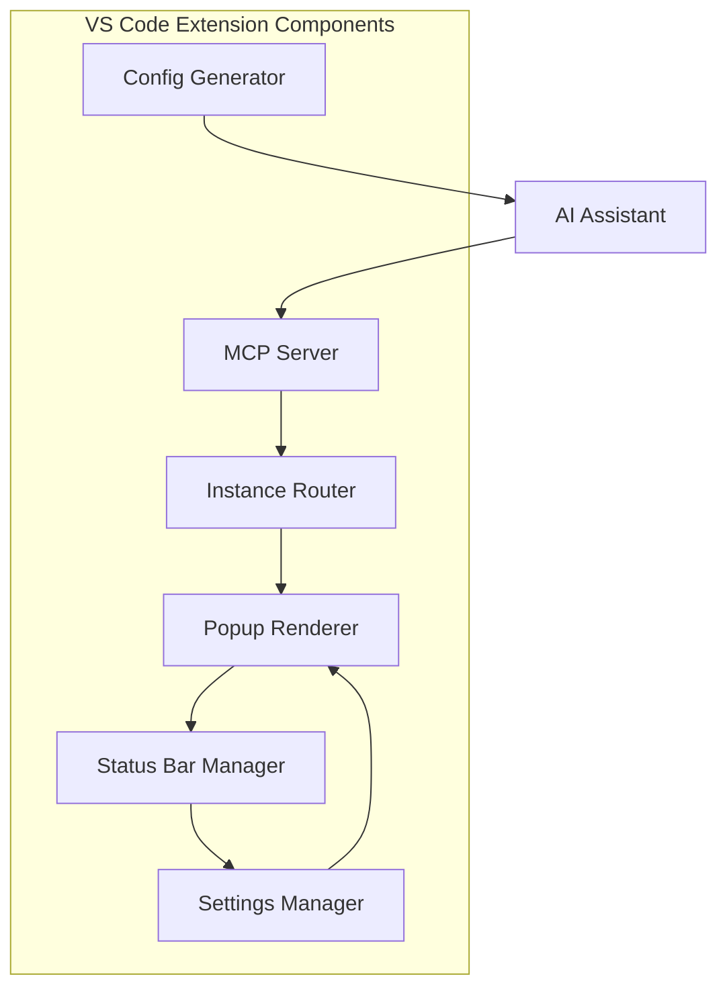

# Components

## MCP Server
**Responsibility:** Central handler for incoming MCP requests (HTTP/stdio), generates requestIds, coordinates routing, and manages sessions.

**Key Interfaces:**
- receiveRequest(PopupRequest): void - Processes incoming requests.
- sendResponse(PopupResponse): void - Routes responses back to AI.

**Dependencies:** VS Code API (for workspace detection), Node.js (for transport).

**Technology Stack:** Node.js, TypeScript; HTTP/Stdio transports.

## Popup Renderer
**Responsibility:** Displays popups in webview tabs with title, message, buttons, and custom text; handles user input and chime.

**Key Interfaces:**
- renderPopup(PopupRequest): void - Creates and shows webview.
- captureResponse(): PopupResponse - Collects user input.

**Dependencies:** MCP Server (for requests), ExtensionConfig (for settings).

**Technology Stack:** VS Code Webview API, HTML/CSS/TS, custom styling.

## Instance Router
**Responsibility:** Detects workspaces and routes requests to the correct VS Code instance; elects server/client roles.

**Key Interfaces:**
- registerWorkspace(path: string): void - Registers instance.
- routeToInstance(request: PopupRequest): void - Forwards to target.

**Dependencies:** VS Code Workspace API, MCP Server.

**Technology Stack:** TypeScript, VS Code API.

## Status Bar Manager
**Responsibility:** Displays and updates status indicator with role/connection state; handles chime toggle.

**Key Interfaces:**
- updateStatus(state: StatusState): void - Refreshes indicator.
- toggleChime(): void - Mutes/unmutes.

**Dependencies:** ExtensionConfig, VS Code Window API.

**Technology Stack:** VS Code StatusBarItem API, TypeScript.

## Settings Manager
**Responsibility:** Handles extension configurations (e.g., chime, timeout) via VS Code settings.

**Key Interfaces:**
- getConfig(): ExtensionConfig - Retrieves current settings.
- updateConfig(config: ExtensionConfig): void - Saves changes.

**Dependencies:** VS Code WorkspaceConfiguration API.

**Technology Stack:** VS Code API, TypeScript.

## Config Generator
**Responsibility:** Provides command palette command to generate and copy MCP JSON config for AI assistants (Cursor, Windsurf, Augment Code, Github Copilot, Cline, Roo, Kilo Code), with HTTP/stdio options.

**Key Interfaces:**
- generateConfig(assistant: string, transport: 'http' | 'stdio'): string - Returns JSON string.
- copyToClipboard(json: string): void - Copies to clipboard.

**Dependencies:** VS Code Commands API, Clipboard API.

**Technology Stack:** TypeScript, VS Code API; JSON templates for each assistant/transport.

## Component Diagrams

