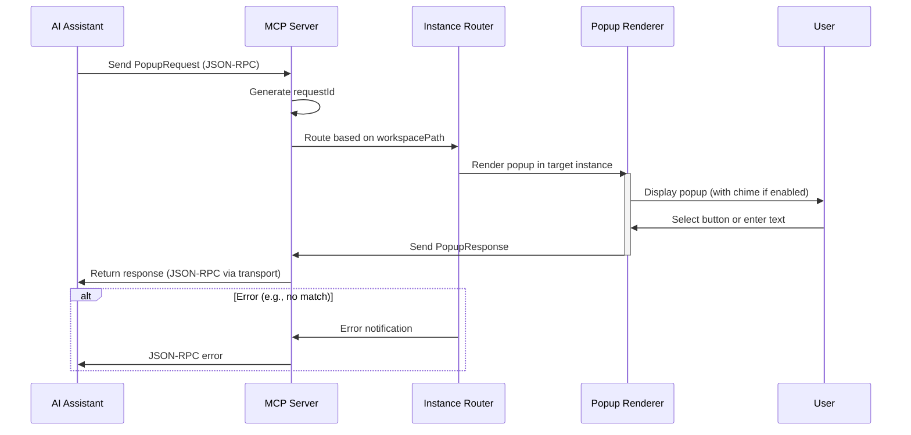

# Core Workflows

This diagram focuses on the primary popup trigger workflow from PRD Epic 1, including routing and error path. Additional diagrams can be added for multi-instance or config flows if needed.
