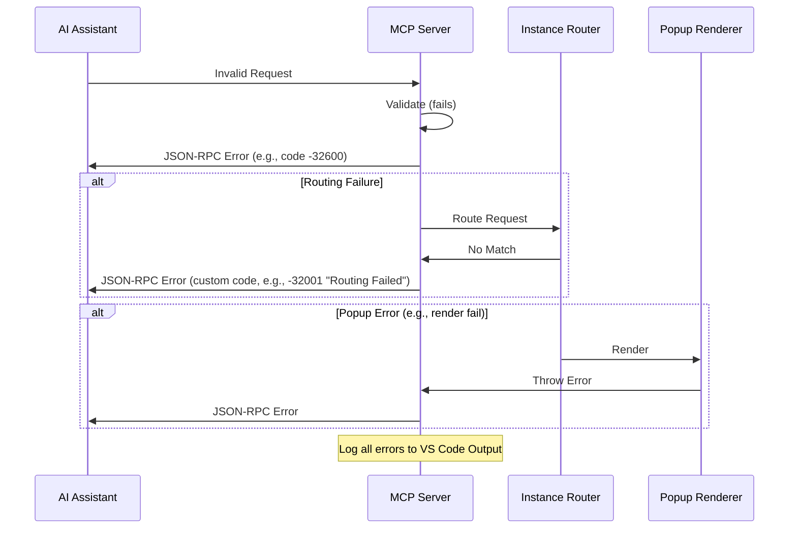

# Error Handling Strategy

## Error Flow


## Error Response Format
```typescript
interface ApiError {
  jsonrpc: '2.0';
  error: {
    code: number;        // JSON-RPC or custom (e.g., -32600 Invalid Request)
    message: string;
    data?: any;          // Optional details
  };
  id: string | null;
}
```

## Frontend Error Handling
```typescript
// PopupWebview.ts example
try {
  // Render logic
} catch (err) {
  vscode.window.showErrorMessage(`Popup error: ${err.message}`);
  appEvents.emit('error', { code: -32000, message: err.message });
}
```

## Backend Error Handling
```typescript
// mcpServer.ts example
async handleRequest(rawReq: string): Promise<string> {
  try {
    // Processing
  } catch (err) {
    console.error(`Server error: ${err}`);  // Log to output channel
    return JSON.stringify({
      jsonrpc: '2.0',
      error: { code: -32603, message: 'Internal error', data: err.stack },
      id: null
    });
  }
}
```
