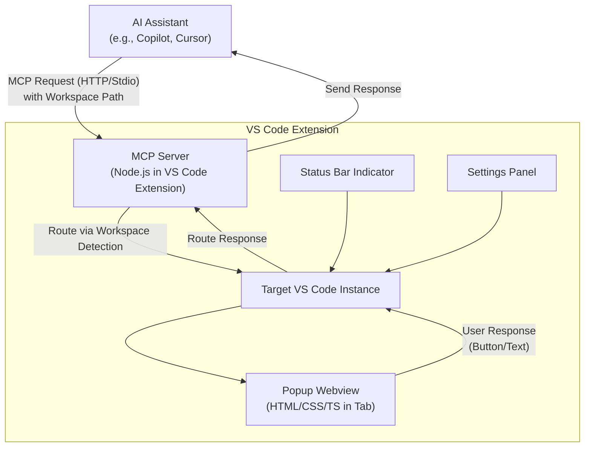

# High Level Architecture

## Technical Summary
Popup MCP is architected as a VS Code extension using a monolithic structure with integrated MCP server logic for handling popup requests and routing. The frontend consists of VS Code UI elements (e.g., webviews for popups, status bar items) built in TypeScript, while the backend handles Node.js-based server coordination for multi-instance support. Key integration points include VS Code APIs for workspace detection and MCP protocol handlers (HTTP/stdio) for AI communication, with responses routed back seamlessly. The extension deploys within VS Code itself, leveraging its runtime for low-latency operations. This architecture achieves PRD goals by enabling zero-config interactive popups that minimize context switching, support accurate multi-instance routing, and integrate natively without external infrastructure, promoting efficient AI-assisted coding workflows.

**Self-Rendering Note:** The hosting instance processes its own popups via the same routing logic as other instances, ensuring uniform handling without special cases.

## Platform and Infrastructure Choice
Based on the PRD's emphasis on a lightweight, self-hosted VS Code extension with no external servers or databases, the recommendation is **VS Code Extension Runtime** as the platform. This aligns with the project's constraints and avoids unnecessary complexity.

Options Considered:
- **VS Code Extension Runtime**: Pros: Native integration, zero external dependencies, low latency; Cons: Limited to VS Code ecosystem, no built-in scaling for non-extension needs.
- **Vercel + Supabase**: Pros: Easy fullstack deployment for web apps; Cons: Overkill for an extension, introduces external hosting not needed per PRD.
- **AWS Lambda**: Pros: Serverless scalability; Cons: Adds complexity and costs for a desktop extension.

**Recommendation**: VS Code Extension Runtime—it's pragmatic for a greenfield extension, directly supporting the PRD's cross-platform (Windows/macOS/Linux) and performance requirements (e.g., <50ms latency) without overhead. User confirmation: Does this align, or should we explore alternatives?

**Platform:** VS Code Extension Runtime  
**Key Services:** VS Code API (for UI, workspace detection), Node.js (for MCP server)  
**Deployment Host and Regions:** Local VS Code instances (cross-platform: Windows, macOS, Linux); no regional deployment needed.

## Repository Structure
Given the PRD's monorepo preference for simplicity in a small extension project, we'll use a single repository structure. No advanced monorepo tools like Nx or Turborepo are needed due to the project's scale, but npm workspaces can be added if shared code emerges.

**Structure:** Monorepo (single repo for all extension code)  
**Monorepo Tool:** N/A (basic npm for dependencies)  
**Package Organization:** Core extension in root, with subfolders for src/ (logic), tests/, and assets/; shared utils if needed.

## High Level Architecture Diagram

Note: Arrows from B to C include self-routing for the hosting instance.

## Architectural Patterns
- **Monolithic Extension Architecture:** All logic (UI, server, routing) in a single VS Code extension bundle - _Rationale:_ Simplifies development and deployment for MVP, aligning with PRD's lightweight needs; avoids microservices overhead.
- **Event-Driven Integration:** Use VS Code events for activation and MCP handlers for requests - _Rationale:_ Enables reactive popup triggering, supporting low-latency PRD goals.
- **Client-Server Coordination:** One instance as MCP server, others as clients with forwarding - _Rationale:_ Handles multi-instance routing per PRD, ensuring reliability without external brokers.
- **Repository Pattern (Lightweight):** Abstract workspace detection and response handling - _Rationale:_ Promotes testability and flexibility for future extensions.
- **API Gateway Pattern (MCP Handler):** Single entry point for all popup requests - _Rationale:_ Centralizes protocol support (HTTP/stdio) and routing logic.
