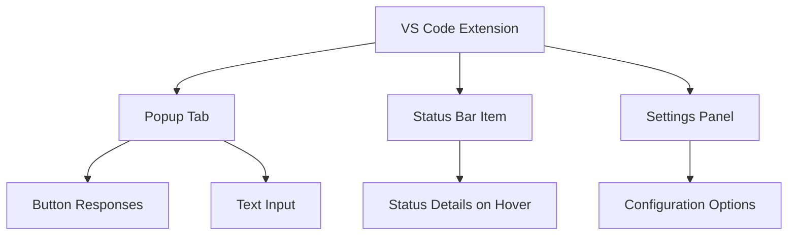

# Information Architecture (IA)

### Site Map / Screen Inventory

### Navigation Structure

**Primary Navigation:** Access to settings via VS Code command palette or status bar clicks for quick actions like muting chime.

**Secondary Navigation:** Within the popup tab, interaction via buttons or text input; no complex menus.

**Breadcrumb Strategy:** Not applicable due to minimal hierarchy; each screen is self-contained with clear titles for context.

