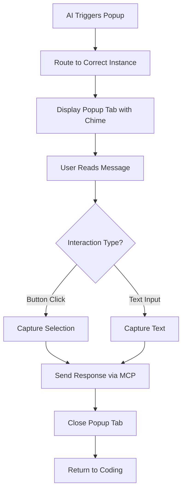
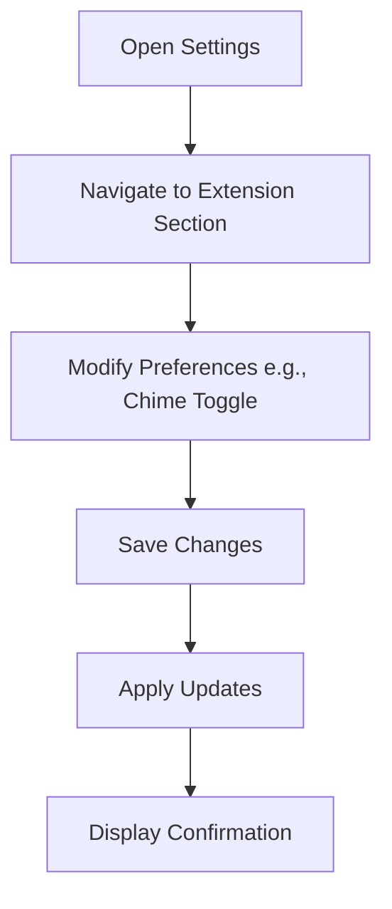

# User Flows

### Popup Interaction Flow

**User Goal:** Provide a quick, structured response to an AI-triggered query without disrupting coding workflow.

**Entry Points:** AI assistant sends popup request via MCP (HTTP or stdio).

**Success Criteria:** User selects button or enters text, response is routed back to AI, popup tab closes automatically.

#### Flow Diagram

#### Edge Cases & Error Handling:
- Ambiguous routing: Display error in status bar and fallback to first instance.
- No user response: Auto-dismiss after configurable timeout with default response.
- Muted chime: Visual notification only via status bar flash.
- Accessibility mode: Ensure keyboard-only navigation with screen reader announcements.

**Notes:** Flow emphasizes minimal steps (1-2 interactions) to reduce cognitive load; integrates with VS Code tabs for familiarity.

### Settings Configuration Flow

**User Goal:** Customize extension behaviors like chime settings or popup preferences.

**Entry Points:** Via VS Code settings panel or command palette.

**Success Criteria:** Changes saved and applied immediately, with confirmation message.

#### Flow Diagram

#### Edge Cases & Error Handling:
- Invalid input: Real-time validation with error tooltips.
- Conflicts with VS Code settings: Prioritize extension defaults with warnings.

**Notes:** Simple flow leveraging VS Code's built-in settings UI for consistency.

